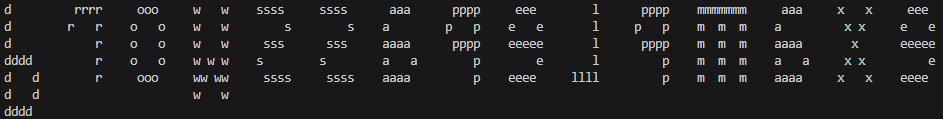

# mirrored-passwords

Script which helps you to mirror your password easier.

# Example usage:

##### Lets say we have a password - example password

##### The output of that password will be the following:

The output of the script has to be written down on paper and when you need the password you will need a mirror to read it. This way you extra secure your password.

## It works only with numbers and latin letters. It doesn't work with special symbols.
